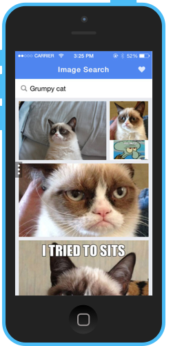

# Image Search    

Image Search is an official open sourced Kik Messenger app that allows you to search for images and share them with your friends on Kik.

### Make It Your Own

  1. Fork this repository
  2. Make edits with your favorite tools, and commit your code
  3. Click the **Live Demo** button on your repository to view the results of your changes.
  4. Share your app with your friends on Kik Messenger! The link is provided to you when you click on the **Live Demo** button.  

**Note:** To use the **Live Demo** button on your own fork, you will need to sign up for a Kite account. To sign up, simply, click the **Live Demo** button on your own repository.   

### Local Setup

From the command line:

1. Navigate to the root `/image-search` directory, then run `npm install`. NPM will look at [package.json](https://github.com/twbs/bootstrap/blob/master/package.json) and automatically install the necessary local dependencies listed there.

**Unfamiliar with npm or if you don't have node installed?** That's okay! NPM stands for [node packaged modules](http://npmjs.org/) and is a way to manage development dependencies through node.js. [Download and install node.js](http://nodejs.org/download/) before proceeding.

**Run Debug Server**

1. Run `npm start`
2. Visit [localhost:5000](http://localhost:5000/) on your browser to see the app running.

### Kik Developer Resources

All developer resources can be found on [http://dev.kik.com](http://dev.kik.com).

### Copyright and License

Code released under the MIT license. Code and documentation copyright 2014 Kik Interactive, Inc.
